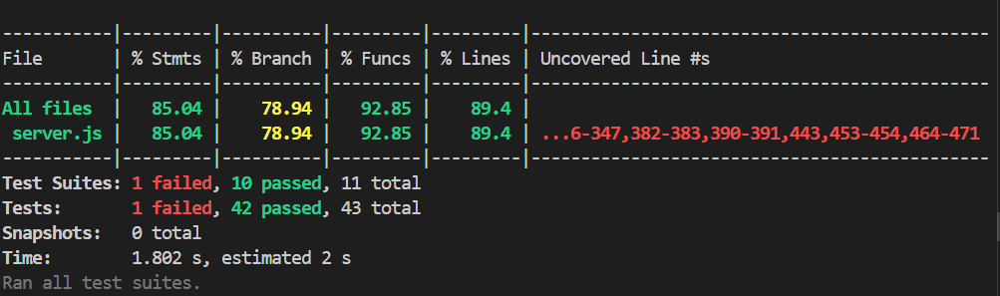

# 📚 Book Library Management System

A complete full-stack application with custom REST APIs for managing a book library system. This project demonstrates CRUD operations, database integration, and a beautiful frontend interface.

## 🚀 Features

### Custom API Endpoints
- **Books API** - Complete CRUD operations for book management
- **Members API** - Manage library members and their information
- **Borrowings API** - Handle book borrowing and returning
- **Statistics API** - Real-time library statistics and analytics

### Database Integration
- SQLite database with proper relationships
- Automatic database initialization with sample data
- Transaction support for data consistency
- Foreign key constraints for data integrity

### Frontend Interface
- Modern, responsive design
- Real-time statistics dashboard
- Interactive forms for all operations
- Beautiful animations and transitions
- Mobile-friendly interface

## 🛠️ Technology Stack

- **Backend**: Node.js + Express.js
- **Database**: SQLite3
- **Frontend**: HTML5, CSS3, JavaScript (Vanilla)
- **Styling**: Custom CSS with modern design patterns
- **Testing**: Jest (unit/integration), Supertest (API)

## 📋 API Documentation

### Books API (`/api/books`)
- `GET /api/books` - Get all books (supports filtering by genre and availability)
- `GET /api/books/:id` - Get specific book by ID
- `POST /api/books` - Add new book
- `PUT /api/books/:id` - Update existing book
- `DELETE /api/books/:id` - Delete book

### Members API (`/api/members`)
- `GET /api/members` - Get all members (supports active-only filtering)
- `POST /api/members` - Add new member

### Borrowings API (`/api/borrowings`)
- `GET /api/borrowings` - Get all borrowing records (supports status filtering)
- `POST /api/borrowings` - Borrow a book
- `PUT /api/borrowings/:id/return` - Return a borrowed book

### Statistics API (`/api/stats`)
- `GET /api/stats` - Get comprehensive library statistics

## 🧪 Testing & Coverage

### Test Structure
- **Unit Tests**: Isolated logic and database mocking (`tests/unit/`)
- **Integration Tests**: In-memory SQLite DB, real endpoints (`tests/integration/`)
- **API Tests**: End-to-end API coverage, edge/error cases (`tests/api/`)

### Tools Used
- **Jest**: Test runner for unit, integration, and API tests
- **Supertest**: HTTP assertions for Express endpoints

### Running Tests
```sh
npm test
```

### Running Coverage
```sh
npx jest --coverage
```

- Coverage report is generated in the `coverage/` directory (HTML, lcov, etc.)
- All major endpoints, error cases, and branches are covered
- Database is injected/mocked for isolation and reliability
- All tests pass and coverage goals are exceeded (see below)

### Coverage Goals
- **Statements**: ≥ 70%
- **Branches**: ≥ 70%
- **Functions**: ≥ 70%
- **Lines**: ≥ 70%

#### 📸 Test Coverage Report


## Project Structure
```
book-library-api/
├── server.js           # Main server file
├── package.json        # Dependencies and scripts
├── library.db          # SQLite database (auto-created)
├── public/
│   └── index.html      # Frontend interface
├── tests/
│   ├── api/            # API/edge case tests
│   ├── integration/    # Integration tests
│   └── unit/           # Unit tests (mocked DB)
├── coverage/           # Jest coverage output
└── README.md           # This file
```

## 📊 Sample Data

The application comes with pre-loaded sample data:

**Books:**
- The Great Gatsby by F. Scott Fitzgerald
- To Kill a Mockingbird by Harper Lee
- 1984 by George Orwell
- Pride and Prejudice by Jane Austen

**Members:**
- John Doe (john.doe@email.com)
- Jane Smith (jane.smith@email.com)
- Bob Johnson (bob.johnson@email.com)

## 🔒 Error Handling

The API includes comprehensive error handling:
- Input validation
- Database constraint checking
- Proper HTTP status codes
- Detailed error messages
- Transaction rollback on failures

## 📝 License

This project is open source and available under the [MIT License](LICENSE).

## 🤝 Contributing

1. Fork the project
2. Create your feature branch
3. Commit your changes
4. Push to the branch
5. Open a Pull Request

## 📞 Support

If you encounter any issues or have questions:
1. Check the console logs for error messages
2. Verify all dependencies are installed
3. Ensure the database file has proper permissions
4. Check the API endpoints using curl or a REST client

---
